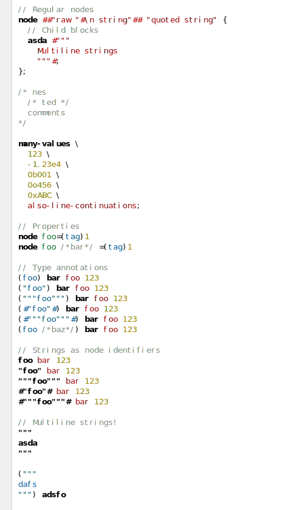

# KDL for Kate

This extension provides editing and syntax highlighting support for [KDL](https://kdl.dev/), an XML-like document language, to the [Kate](https://kate-editor.org/) text editor and the KDE/KatePart [Syntax Highlighting Engine](https://invent.kde.org/frameworks/syntax-highlighting).

See [`docs/example.kdl`](docs/example.kdl).

## Installation

- Identify the directory in which custom syntax highlighting files are located. See [the corresponding section of Chapter 6](https://docs.kde.org/stable5/en/kate/katepart/highlight.html#katehighlight-xml-format) of [The KatePart Handbook](https://docs.kde.org/stable5/en/kate/katepart/). On Linux this is usually `$HOME/.local/share/org.kde.syntax-highlighting/syntax/`.

- Download [`kdl.xml`](kdl.xml) and copy it into the aformentioned directory.

- Restart Kate. Alternatively, press <kdb>F7</kdb>, type `reload-highlighting`, and press enter.

## Limitations

- Slash-dash comments are not highlighted properly.
- Property keys are highlighted as string values if the equals sign appears on a different line, or if the equals sign is preceded by a nested `/**/` comment.
- Whitespace or line comments after line continuations are not supported.
- Mandatory whitespace between values is not checked.
- Whitespace requirements of multiline strings are not checked.
- Whitespace escapes with newlines are not handled.
